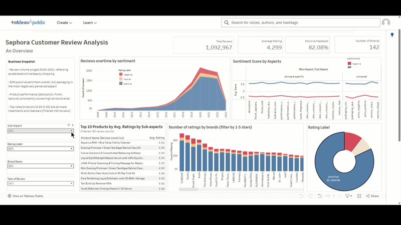

# Sephora Customer Review Sentiment Analysis
Aspect-level sentiment analysis of 1M+ skincare reviews across 2,000+ products and 142 brands using VADER, with interactive Tableau dashboards for business insights.

[Link](https://public.tableau.com/app/profile/linh.n2773/viz/NLP-SephoraProject/OverviewDashboard)

### Overview
Customer reviews are a goldmine for understanding product perception, but at scale (1M+ reviews), manual analysis is impossible. This project applies aspect-based sentiment analysis using VADER to extract granular insights from Sephora skincare reviews. The result will go beyond "Is this product loved?" to "What specific aspects of this product that customers love or hate?"

### Key Findings

- 82% positive sentiment overall, but packaging is the most negatively perceived aspect
- Review volume surged 2019–2022, reflecting accelerated online beauty shopping
- Product performance (absorption, finish, texture) consistently scores high across brands
- Hydration moisture and performance comfort show below-average scores for some brands, signaling inconsistency in core product claims
- Top-rated products (4.93–5.00) are concentrated in skincare treatments and cleansers

### Dashboards
1. Overview
High-level KPIs, sentiment trends over time, rating distribution by brand, and top products by sub-aspect ratings.

2. Brands × Aspects x Products
Brand-level and product-level sentiment breakdown by sub-aspects, performance vs. category average comparison, and aspect performance scatter (mention frequency vs. sentiment score).

[Link](https://public.tableau.com/app/profile/linh.n2773/viz/NLP-SephoraProject-2_17772571304140/DetailedDashboard)

### Methodology
1. Data
Source: Sephora Products and Skincare Reviews (Kaggle)
Scale: 1,092,967 reviews · 2,000+ products · 142 brands · 2008–2023

2. Sentiment Analysis Pipeline
- Data cleaning & preprocessing — Handled missing values, standardized text, filtered by skincare category
- Aspect extraction — Identified 20+ sub-aspects across two main categories: skincare-specific (hydration, absorption, texture, etc.) and universal (packaging, price, service, etc.)
- VADER sentiment scoring — Applied VADER at the aspect level to score each mention as positive, negative, or neutral
- Aggregation & export — Computed average scores by brand, product, and aspect; exported to CSV for Tableau
